# MoviesHub - Plataforma de Entretenimiento

## 1. MoviesHub

**MoviesHub** - Plataforma Web para visualización, recomendación y gestión de películas, es un proyecto fullstack contuida con **Angular** en el frontend, **ASP.NET Core Web API** como backend y **SQL Server** como base de datos.

### 1. Autenticación

- Validación de usuario y contraseña pagina de login:

Usuario: admin     
Contraseña: pass1

**Adicional**
- Contraseñas almacenadas de forma segura con hashing SHA-512.
- Generación y retorno de token usando JWT para proteger rutas privadas.

## 3. Capturas de pantalla del frontend

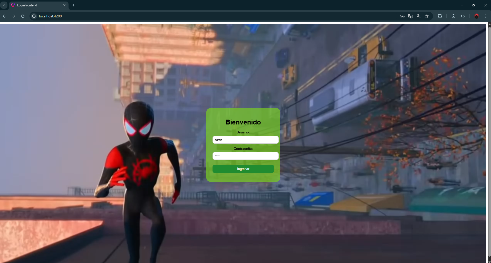  
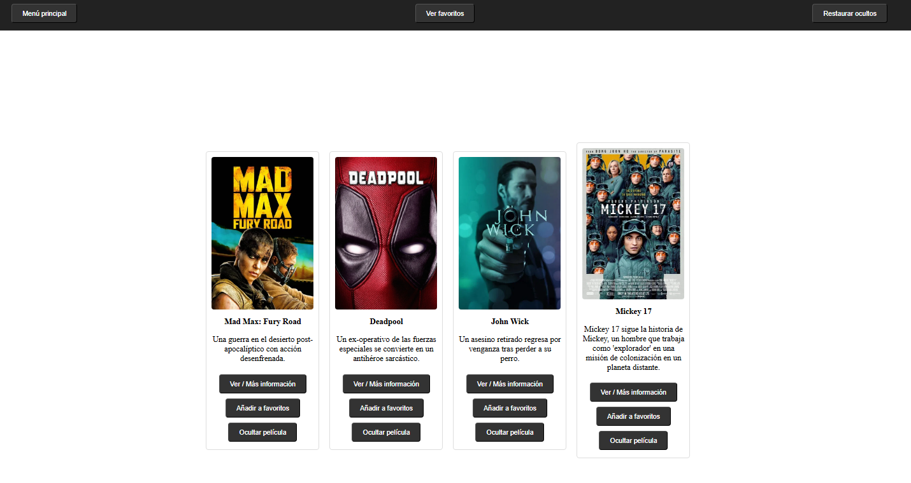  
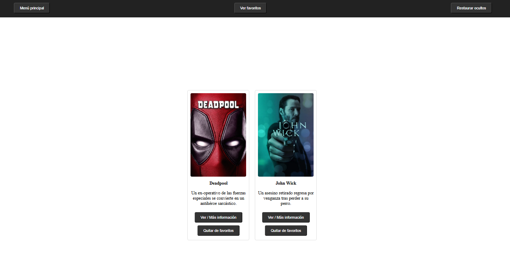  
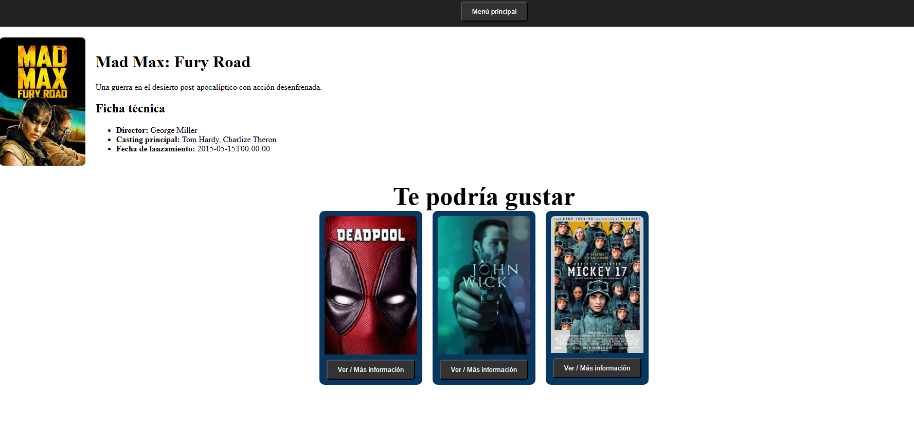  

## 4. Herramientas utilizadas:

Este proyecto fue desarrollado como una aplicación full stack utilizando:

- **Frontend:** Angular 18 (CLI v20.0.0, Node 22.14.0, npm 10.9.2)
- **Backend:** ASP.NET Core 9 con Web API y C#
- **Base de Datos:** SQL Server
- **Contenedores:** Docker

Creacion de Docker files para ApiPeliculas y frontend, asi como de la imagen SQL Server, y cracion de las imagenes moviefrontend y moviebackend

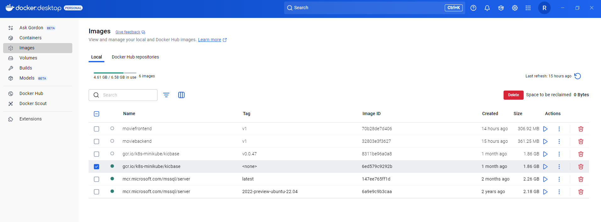

### Descripcion de como se hizo, pasos:

1. **Modelado de la base de datos:** Se definieron tablas como `Users`, `Movies`, `UserFavorites`, `MovieSuggestions`, siguiendo las reglas de normalización.
2. **API RESTful en ASP.NET Core:** Se implementó el backend usando el patrón MVC, controladores REST, y Entity Framework Core.
3. **Hashing de contraseñas:** Se usó SHA-512 para proteger credenciales.
4. **Frontend Angular:** Se creó un login con video de fondo, rutas protegidas, componentes de catálogo, favoritos, y detalle.
5. **Dockerización:** Se generaron 3 Dockerfiles (frontend, API, SQL Server),
6. **Pruebas y documentación:** Se documentó el backend con Swagger.

- Se integró **Swagger** para documentar todos los endpoints del backend.
- Accesible en `http://localhost:5291/swagger` (al ejecutar la API).


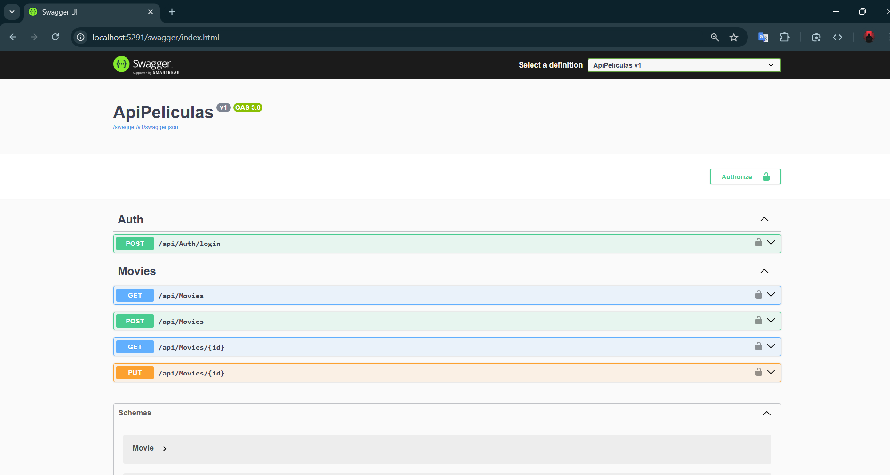

#### Captura de pantalla autentificacion en Swagger con Token

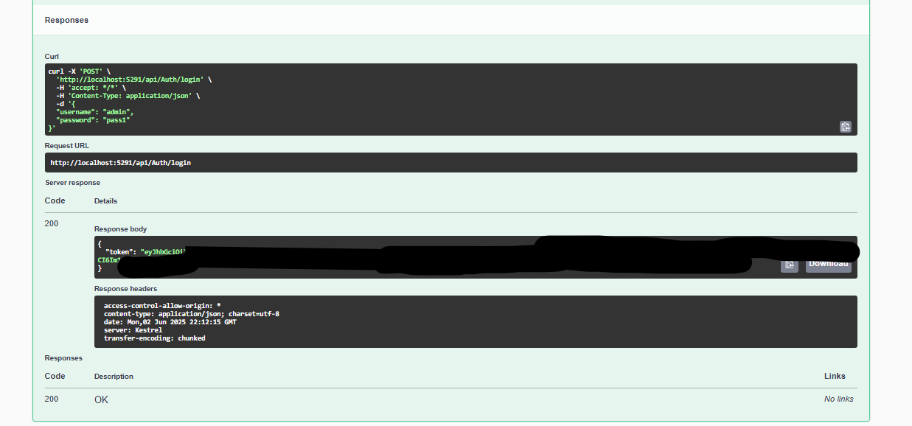

#### Capturas de pantalla de POST en Swagger:

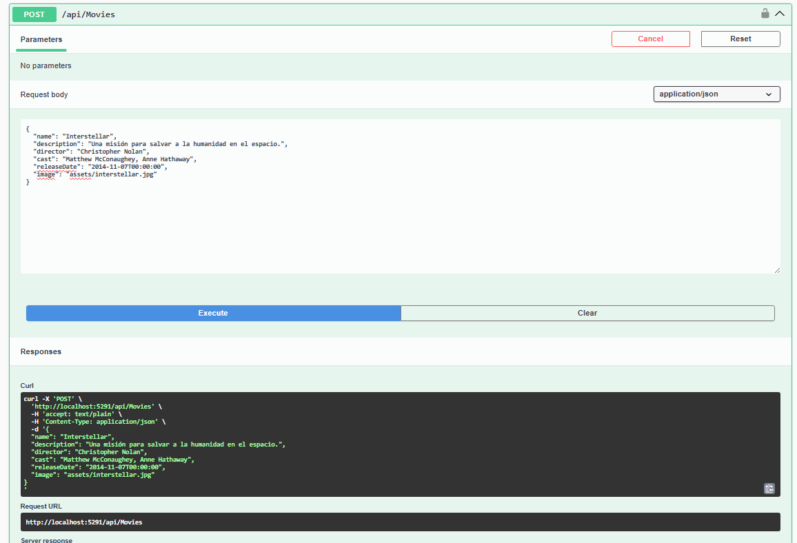

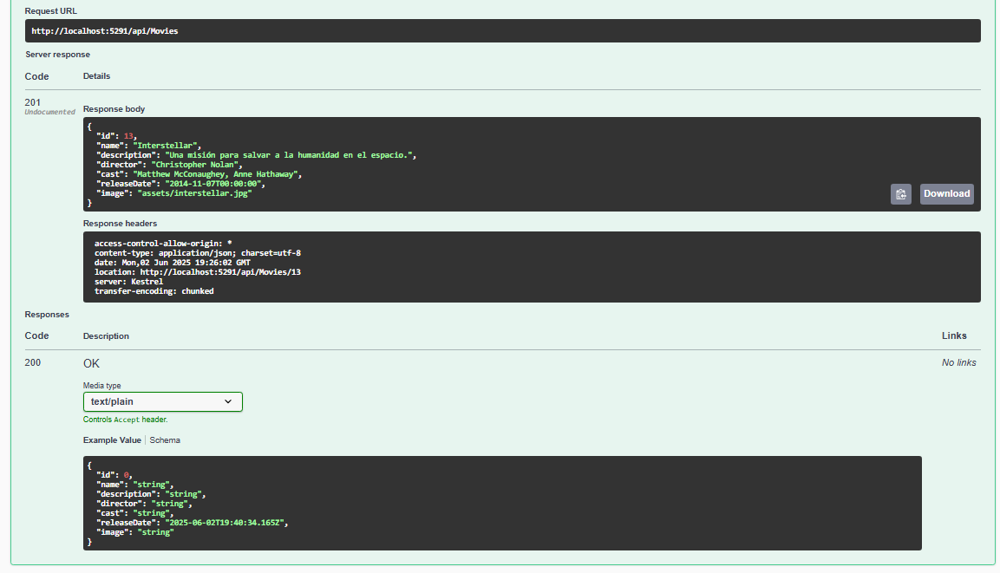

- Se agrega Metodo PUT para actualizar o modificar informacion del catalogo de peliculas

#### Capturas de pantalla de PUT en Swagger:

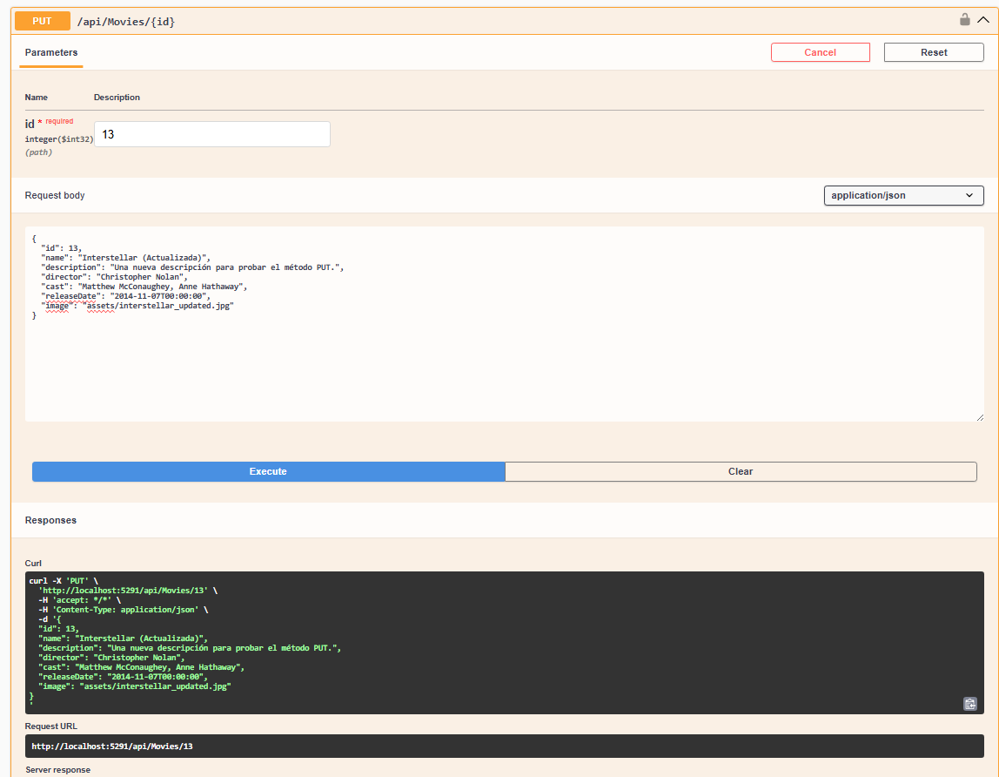
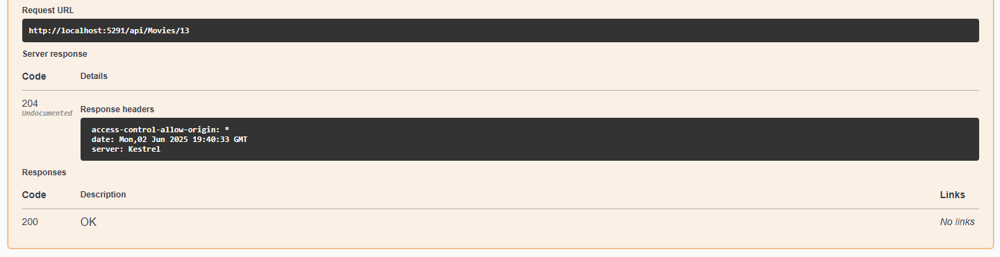

### Configuración de CORS

- Se habilitó **CORS** en el backend para permitir solicitudes desde Angular (`http://localhost:4200`).
- Esto resolvió errores de tipo `CORS policy blocked`.   
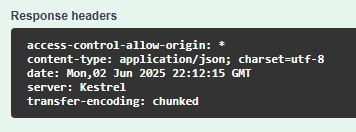

## 5. Diagrama de Entidad-Relación de la Base de Datos

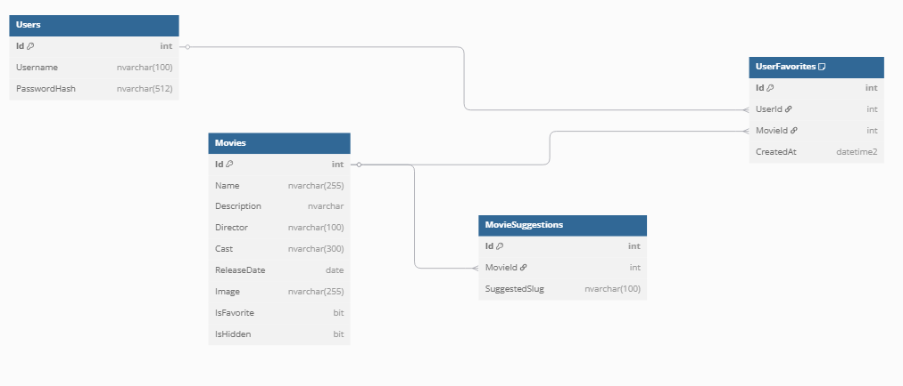

Estructura base:

- `Users (Id, Username, PasswordHash)`
- `Movies (Id, Name, Description, Director, Cast, ReleaseDate, Image, IsFavorite, IsHidden)`
- `UserFavorites (Id, UserId, MovieId, CreatedAt)`
- `MovieSuggestions (Id, MovieId, SuggestedSlug)`

## 6. Problemas Conocidos
- No hay roles de administrador en la base de datos definidos aún.

## 7. Retrospectiva

### ¿Qué hice bien?

- Aprendí a integrar todas las capas de un proyecto full stack moderno.
- Implementé seguridad básica con hashing de contraseñas.
- Se integró de manera funcional el login usando JWT con hashing de contraseñas.
- Se documentó la API REST usando Swagger para pruebas y exploración.

### ¿Qué no salió bien?

- Algunas rutas de Angular tuvieron errores al recargar al principio, sin embargo se soluciono
- La sincronización del frontend con el backend al consumir la API requirió ajustes en los endpoints.
- Algunos errores de CORS surgieron durante la integración inicial.

### ¿Qué puedo hacer diferente?

- Agregar testing unitario y de integración.
- Usar CI/CD para automatizar despliegues con GitHub
- Una mejora futura sería integrar una API pública de películas en lugar de cargar los datos desde un JSON manualmente.
---

## Instrucciones para correr el proyecto

1. Clona este repositorio:

```bash
git clone https://github.com/Roger0369/movieshub_sprint6.git
cd movieshub
```

## Ejecutar el proyecto localmente

### Requisitos previos

Asegúrate de tener instalados:

- [.NET SDK 8+](https://dotnet.microsoft.com/download)
- [Node.js 18+](https://nodejs.org/)
- [SQL Server](https://www.microsoft.com/es-mx/sql-server/sql-server-downloads) (puede ser SQL Server Express)
- Visual Studio o Visual Studio Code
- (Opcional) SQL Server Management Studio (SSMS)

---

### 1. Configura la base de datos

1. Abre SQL Server y crea la base de datos llamada `LoginApp`.
2. Ejecuta el script SQL que se encuentra en `SQL_server/init.sql` para crear las tablas y datos iniciales.

---

### 2. Ejecutar el Backend (`ApiPeliculas`)

1. Abre una terminal en la carpeta `ApiPeliculas/`.
2. Verifica que en `appsettings.Development.json` tengas la siguiente cadena de conexión:

```json
"ConnectionStrings": {
  "DefaultConnection": "Server=localhost;Database=LoginApp;Trusted_Connection=True;TrustServerCertificate=True;"
}
```

Ejecuta el backend con:

```
dotnet run
```

El backend se ejecutará en http://localhost:5291
--

### Ejecutar el Frontend (login-frontend)
Abre otra terminal y navega a la carpeta login-frontend/.

```
cd login-frontend
```

Instala las dependencias:
```
npm install
```
Ejecuta el servidor de desarrollo:
```
ng serve
```

El frontend se abrirá en http://localhost:4200
--

### Verifica la conexión
Asegúrate de que el archivo login-frontend/src/environments/environment.ts tenga la URL correcta del backend:
```
export const environment = {
  production: false,
  apiUrl: 'http://localhost:5291/api'
};
```

### Inicia sesión con el siguiente usuario de prueba:

Una vez ejecutado el fornt en la pagina de login ingresa la informacion correspondiente:

- Usuario: admin     
- Contraseña: pass1

Explora el catálogo de películas, agrégalas a favoritos, ocúltalas o consulta sus detalles.
